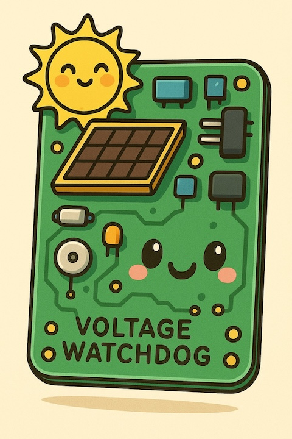
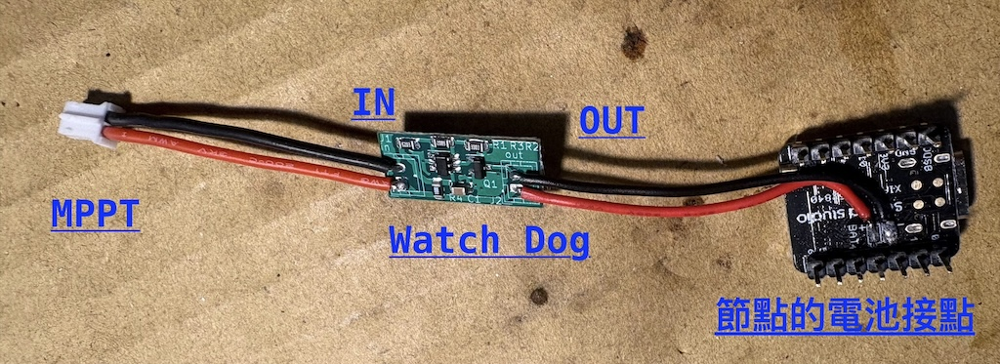

# WatchDog_pcb
一個迷你的電池電壓看門狗電路板  
A tiny WatchDog PCB for monitoring and protecting battery voltage in low-power nodes.

---

## 緣起｜Background

在 [Meshtastic Taiwan 台灣鍊網](https://www.facebook.com/groups/meshtastictw) 社群中，許多同好長期面臨太陽能節點在低電量狀態下產生的不穩定問題，例如反覆重啟、遺失設定或電池過度放電。

為了解決這類問題，社群中一位不願具名、但長期關注社群動態的熱心前輩 **Hsieh** 設計了這塊迷你電壓看門狗電路板。  
此設計的初衷，是在電池電壓過低時自動斷電保護節點，並在電壓恢復後重新供電，以提升整體系統的穩定性與可靠度。

本專案由發布者代為整理並開源，期望能拋磚引玉，邀請更多社群成員一同改良、延伸此設計，並將成果回饋給開源硬體社群。

---

## ♥ Thanks ♥

特別感謝 **Hsieh** 無私地分享其設計，讓社群得以受益。

---

## 功能｜Features

- 當電池電壓低於 **3.1V** 時自動斷電保護  
- 當電池電壓回升至 **3.7V（約 50%）** 時自動恢復供電  
- 迷你尺寸設計：約 **20 mm × 10 mm**  
- 可透過調整電阻值，自行設定斷電與恢復供電的電壓門檻  
- 設計基於 **CN312** 晶片  
  - Datasheet: https://www.shotech.de/Datasheet/consonace/DSE-CN312.pdf

---

## 使用方式｜Usage

- **IN**：連接 MPPT（太陽能充電模組）  
- **OUT**：連接節點的電池端  
- 通電前請務必再次確認 **正負極方向**

下圖為搭配 **XIAO nRF52** 節點的使用範例：

---

## 聲明與使用授權｜Disclaimer & License

### 中文說明（非法律條文）

- 本專案 **不提供任何形式的保固或維修服務**  
- 使用本設計所產生的任何風險，請使用者自行評估並承擔相關責任  
- 本專案發布者僅協助整理與開源，**並非原始設計者**，亦無法提供客製修改或設計調整之服務，敬請見諒  

---

### 授權條款｜License

本專案採用  
**CERN Open Hardware Licence Version 2 – Weakly Reciprocal (CERN-OHL-W v2)** 授權。

你可以：
- 使用、修改、打樣、製造與販售基於本設計的 PCB  
- 將本專案用於個人或商業用途  

但請注意：
- **請務必註明原作者與專案來源**  
- 若你修改了任何設計檔（包含原理圖、PCB Layout 或 KiCad 專案檔），  
  **必須以相同授權（CERN-OHL-W v2）公開釋出修改後的設計檔**  
- 在散佈或販售修改後的設計時，需一併提供對應的原始設計檔  

此授權的目的，在於確保所有改進與衍生設計能持續回饋給開源硬體社群。

---

## English Version

### Background

Within the [Meshtastic Taiwan](https://www.facebook.com/groups/meshtastictw) community, many members have long faced stability issues with solar-powered nodes when operating under low battery conditions.  
These issues commonly include repeated reboots, lost settings, or excessive battery discharge.

To address these problems, a long-time community contributor, **Hsieh** (who prefers to remain unnamed), designed this tiny battery voltage watchdog PCB.  
The original intent of this design is to automatically cut off power when the battery voltage drops too low, and to restore power once the voltage recovers, thereby improving overall system stability and reliability.

This project is published and open-sourced by the repository maintainer on behalf of the original designer.  
By sharing this design openly, we hope to encourage further improvements and extensions, and to invite the community to share their enhancements back with the open hardware ecosystem.

---

### Thanks

Special thanks to **Hsieh** for generously sharing this design with the community.

---

### Features

- Automatically disconnects power when battery voltage drops below **3.1V**  
- Automatically restores power when battery voltage rises above **3.7V (approximately 50%)**  
- Compact form factor: approximately **20 mm × 10 mm**  
- Voltage cutoff and restore thresholds can be adjusted by changing resistor values  
- Design based on the **CN312** integrated circuit  
  - Datasheet: https://www.shotech.de/Datasheet/consonace/DSE-CN312.pdf

---

### Usage

- **IN**: Connect to MPPT (solar charging module)  
- **OUT**: Connect to the node’s battery terminal  
- Before applying power, please carefully verify correct polarity

The image below shows an example used with a **XIAO nRF52** node:

---

### Disclaimer

No warranty of any kind is provided.  
Use this design at your own risk, and assume full responsibility for any outcomes resulting from its use.

The publisher of this repository is not the original designer of the circuit and provides this project solely for the purpose of open sharing.  
No guarantees regarding performance, reliability, or suitability for any particular application are expressed or implied.

---

### License

This project is licensed under the  
**CERN Open Hardware Licence Version 2 – Weakly Reciprocal (CERN-OHL-W v2)**.

You are allowed to:
- Study, use, modify, manufacture, and sell PCBs based on this design  
- Use this project for both non-commercial and commercial purposes  

Conditions:
- **Attribution is required** — you must credit the original author and the project source  
- **If you modify any design files** (including schematics, PCB layouts, or KiCad project files),  
  you must release those modifications under the same license (**CERN-OHL-W v2**)  
- When distributing or selling modified designs, the corresponding source design files must also be made available  

This license is intended to ensure that improvements and derivative works continue to benefit the open hardware community.

**SPDX-License-Identifier:** CERN-OHL-W-2.0
